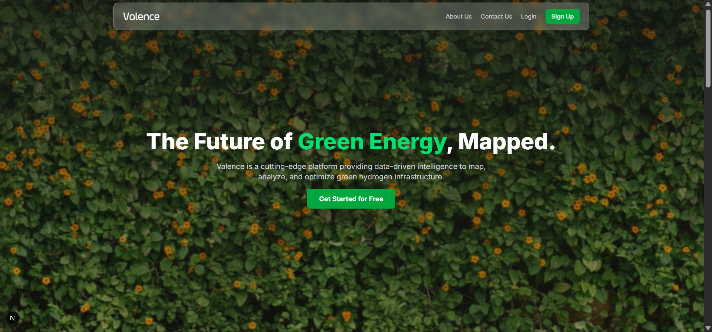
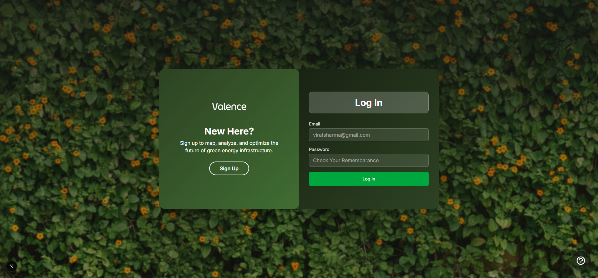
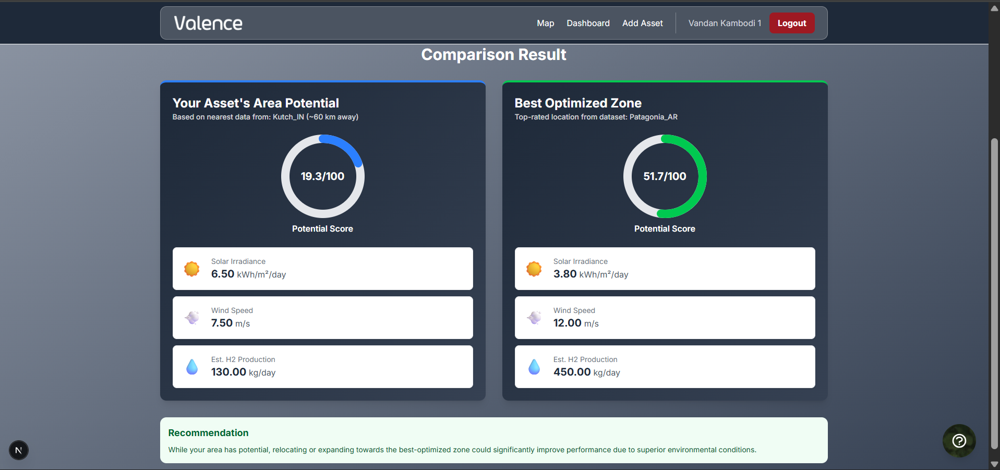
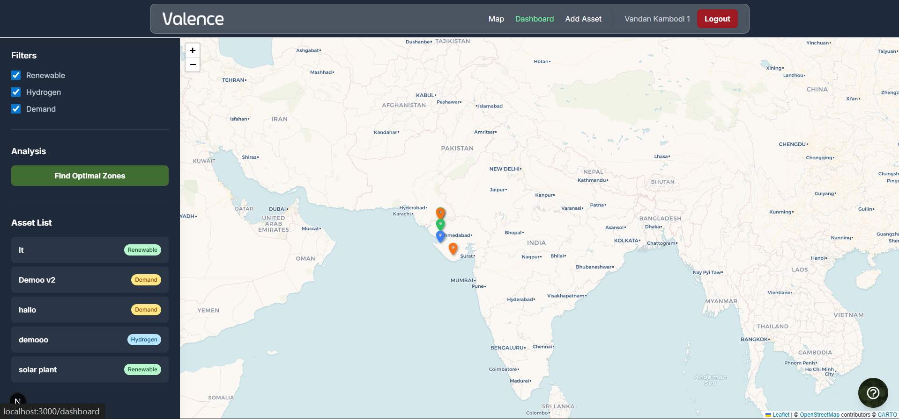
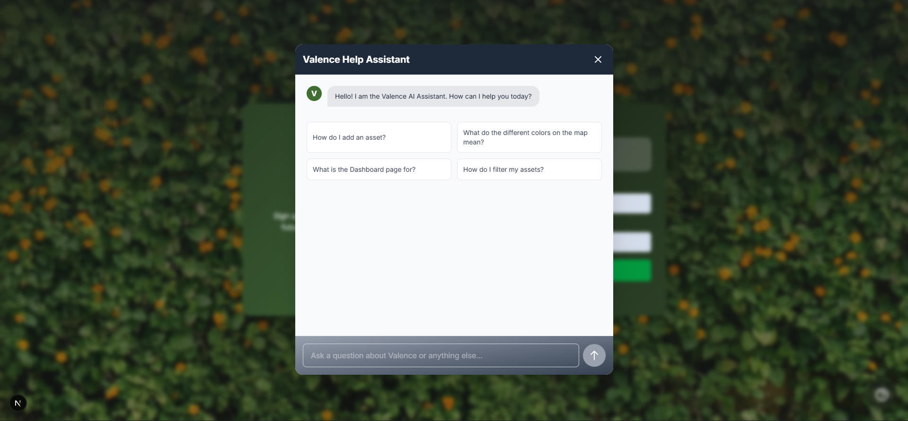

# Valence 🌐

Valence is a **community-driven platform** designed to connect users with geospatial data, dashboards, and comparative insights in an intuitive and interactive way. Built with **Next.js, TailwindCSS, Prisma, MongoDB, and NextAuth.js**, the application provides a seamless experience for both users and administrators.

---

## 📑 Table of Contents
- [Overview](#overview)
- [Features](#features)
- [Tech Stack](#tech-stack)
- [Project Structure](#project-structure)
- [Installation](#installation)
- [Usage](#usage)
- [Environment Variables](#environment-variables)
- [Screenshots](#screenshots)
- [Contributing](#contributing)
- [License](#license)

---

## 🚀 Overview
Valence enables users to:
- View maps with geospatial filters.
- Compare different assets and regions.
- Use authentication flows (signup/login) with secure JWTs.
- Access dashboards with personalized insights.

---

## ✨ Features
- 🔐 **Authentication** with NextAuth.js (Login/Signup)
- 🗺️ **Interactive Maps** with user-specific data
- 📊 **Dashboards** showing filters, comparisons, and results
- 📧 **Contact Forms** integrated with external mail services
- ⚡ **Modern UI** built with TailwindCSS and shadcn/ui components

---

## 🛠️ Tech Stack
- **Frontend:** Next.js, React, TailwindCSS, shadcn/ui
- **Backend:** Next.js API routes, Node.js
- **Database:** MongoDB with Prisma ORM
- **Auth:** NextAuth.js with JWT
- **Other:** External mailer service for contact forms

---

## 📂 Project Structure
```bash
valence/
│
├── public/                 # Static assets (favicons, images)
│
├── prisma/                 # Prisma schema & migrations
│   └── schema.prisma
│
├── src/
│   ├── app/                # Next.js App Router (pages)
│   │   ├── api/            # API routes (contact, auth, etc.)
│   │   ├── map/            # Protected map page
│   │   ├── dashboard/      # User dashboard
│   │   ├── auth/           # Authentication pages (login/signup)
│   │   └── page.tsx        # Landing page
│   │
│   ├── components/         # Reusable UI components
│   ├── lib/                # Utility functions (auth, db, helpers)
│   ├── styles/             # Global styles (Tailwind)
│   └── types/              # TypeScript types/interfaces
│
├── .env.local              # Environment variables (not committed)
├── package.json            # Dependencies & scripts
└── README.md               # Project documentation
```

---

---

## ⚙️ Installation
1. **Clone the repository**
   ```bash
   git clone https://github.com/vandankambodi/valence.git
   cd valence
   ```

2. **Install dependencies**
   ```bash
   npm install
   ```

3. **Setup Prisma**
   ```bash
   npx prisma generate
   npx prisma db push
   ```

4. **Run the development server**
   ```bash
   npm run dev
   ```

---

## ▶️ Usage
- Visit `http://localhost:3000` to open the landing page.
- Sign up or log in via the authentication flow.
- Explore maps and dashboards.
- Use the contact form to send messages (emails delivered via external service).

---

## 🔑 Environment Variables

**Set Up Environment Variables**: Create a file named `.env.local` in the root of the project and add the following, replacing the placeholder values with your actual credentials:

```env
MONGODB_URI=your_mongodb_atlas_connection_string
NEXTAUTH_SECRET=generate_a_strong_secret_key # You can use an online generator
GEMINI_API_KEY=your_google_gemini_api_key # For the chatbot feature
RESEND_API_KEY=generate_resend_api_key # To get mail of user from contact us page
```
---

## 🖼️ Screenshots
- **Landing Page**



- **Authentication Page**



- **Dashboard**



- **Map View**



- **AI Assistant**


---

## 🤝 Contributing
Contributions are always welcome!

1. Fork the repo
2. Create a new branch (`git checkout -b feature-name`)
3. Commit changes (`git commit -m 'Add new feature'`)
4. Push to your branch (`git push origin feature-name`)
5. Open a Pull Request

---

## 📜 License
This project is licensed under the **MIT License**. See [LICENSE](./LICENSE) for details.
